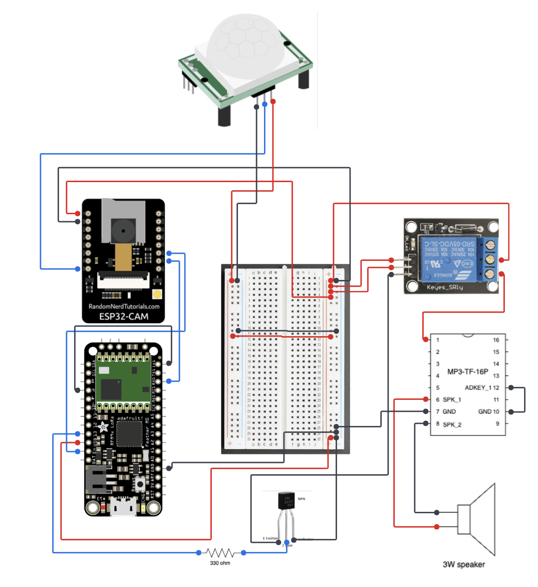
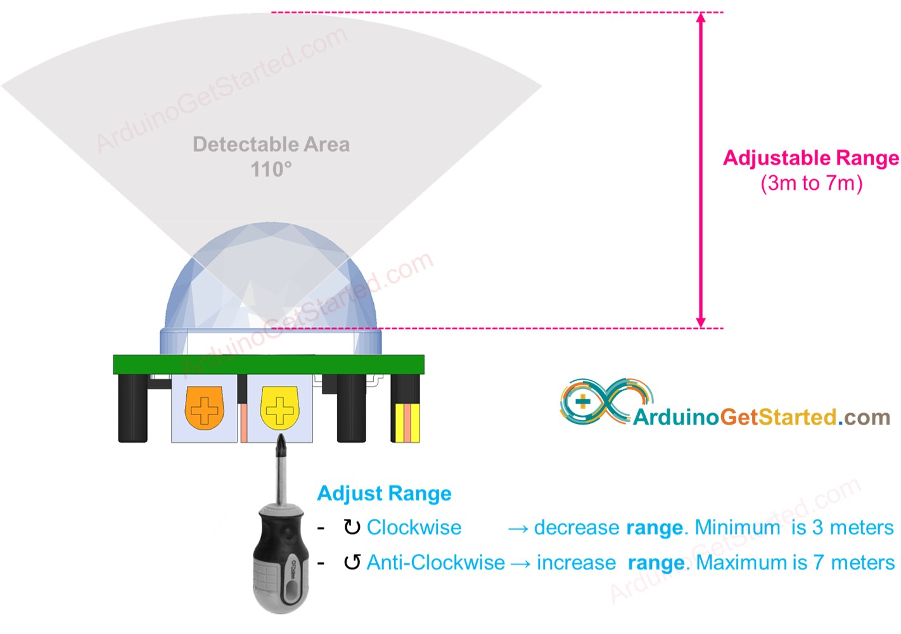
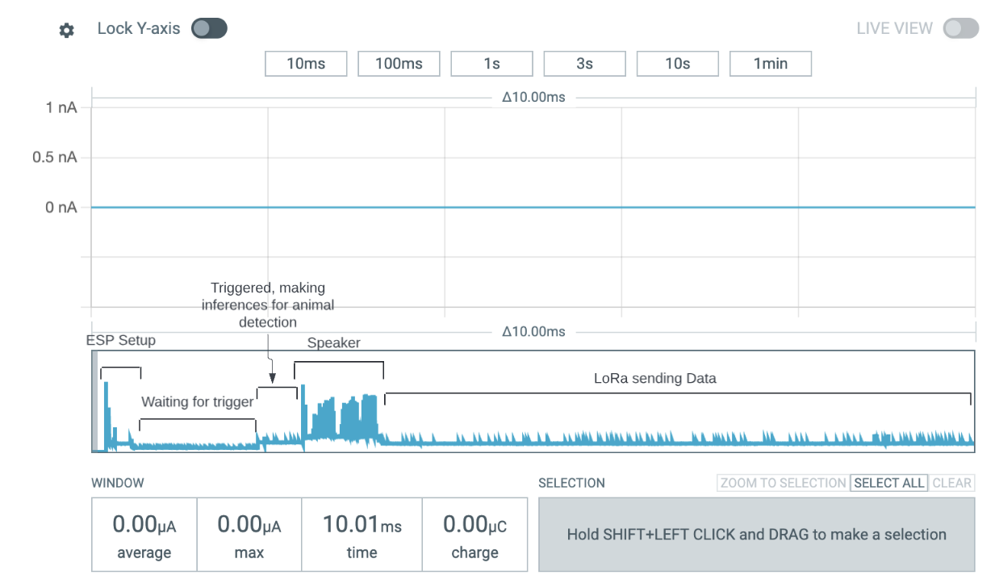
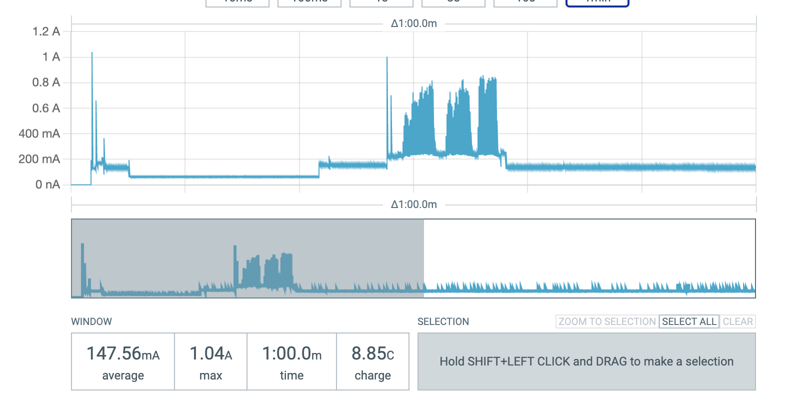
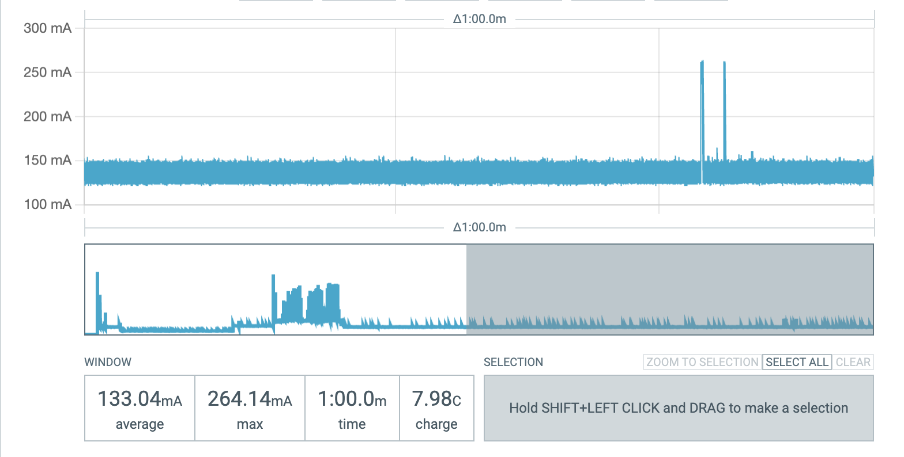

# TinyScrubCAM

## Hardware Circuit Diagram -



## What is TinyScrubCAM?

TinyScrubCAM is a low power consumption device that has been through different iterations. It started as a RaspPi running motion detection sensors and cameras. This version consumed too much power, the whole point of TinyScrubCAM is to be a long lasting animal deterrant. Whenever a animal of interest is caught in our cameras point of view it should play a sound on a speaker in hopes of making the animal flee. To make TinyScrubCAM low powered, we switched over to using microcontrollers powered by battery. Specifically the Google Coral, ESP32, and Feather M0s. We used hardware interrupts to essentially keep our microcontroller draining as little power as possible until the moment that the PIR sensor is triggered which will activate sound and capture an image to the SD card, which will be used to train more machine learning models on local species of animals.

## Clone the Repository

Begin by cloning the TinyScrubCam repository to your local machine (currently in a branch since it is not merged with main):

```sh
git clone https://github.com/conservationtechlab/tinyscrubcam.git
```

## Set Up Instruction

1. Install Arduino IDE
2. Install Adafruit Featherboards

- Open Preferences or Settings
- Copy paste this --> https://adafruit.github.io/arduino-board-index/package_adafruit_index.json
- Open Boards Manager
- Search Adafruit Feather M0
- Install the board library

3. Install MCCI LoRaWAN LMIC library by IBM
4. At time of writing it is at version 4.1.1 (May 31, 2024)
5. In the MCCI config file make sure to change it to the correct region, it is US915 by default.
6. Setup complete!

# MCCI Library is needed for compiling for the featherboard/lora, you need to delete this library and swap it with the esp32cam library to be able to upload to the esp32cam

## How to run?

This is the ESP32CAM version, utilzing an Adafruit Feather M0 Board to communicate over LoRaWAN, sending pings whenever an animal is detected.

1. Upload the code in esp32CAMBuild/featherM0LoRa into the featherboard
2. Upload the code in esp32CAMBuild/esp32_camera to the ESP32CAM
3. Follow the Circuit Diagram to setup hardware
4. To do this you must connect io0 and ground and connect 5V, GND, RX, TX to a USB adapter, or if you have the ESP32CAM uploading board it will be plug and play.
5. After uploading, make sure to click reset on the back of the ESP32CAM, to run the program
6. You are ready to use your camera trap!

## How does it work?

1. ~~The ESP32CAM turns on and immediately goes into light sleep mode. It uses a PIR sensor to trigger it to turn on and make an analysis.~~
2. Currently, the ESP32CAM is repeatedly on a cycle of checking for trigger, due to a bug. It doesn't go into any sleep mode
3. Once a detection is made, your ESP32CAM will capture 10secs worth of pictures, running analysis on each one.
4. If the model finds something, it will save that image, turn on the featherboard. Wait 10 seconds to give it time to power and play the speaker.
5. On enable, Featherboard will activate the speaker, then wait for serial data.
6. The ESP32CAM will then print to serial the detection it made e.g. "cougar" and the featherboard will then send this data over LoRa
7. If it doesn't find anything, it will go back to the loop where it is waiting for a detection

## Optimization/Issues/Future Implementation

Future implementations should look into ~~putting the ESP32CAM into deep sleep, I tried but the interrupt didn't work properly and would often go straight back to sleep everytime it is triggered.~~ I GPIO pinout is very limited on the ESP32CAM, I didn't use the complete left side facing the camera, because those are data lines for the SDCARD, I think it might create some issues using those pins. ~~Although I was able to use one without issue for the PIR Sensor.~~ I was able to use GPIO4 which is an sdcard pin because that pin is for the LED on the physical board. Since ESP32CAM only sends data to featherboard and not back, I had to implement the 3 minute window. Which means if the radio takes 4 minutes to send, it will just be shut off. Another implementation for this could be to make them speak back and forth to one another, I didn't do this because in my debugging I was limited because of the data lines, you can attempt to use the data lines and see if it affects anything. So this implementation would essentially be, ESP32CAM sends the serial data to featherboard, then wait for serial input, feather board will send it over lora, then send over serial that it is finished, then the ESP32CAM will be done and wait for another PIR detection, this way every single detection will be sent. Although, after the current fixes I made after writing this, I was able to get very strong, with better antennas, reliable transmission. It would only take from 30secs to a minute meaning the whole 2 minutes after it is completely doing nothing. Although the 3 minute window is the best implementation since it gives leeway for errors in the field, longer distances, etc.

So the things I mentioned:

1. ~~Deep Sleep for ESP32CAM instead of constant looping (look into ESP32 Deep Sleep)~~ [EDIT: This has been fixed 6/27/24]

2. Bidirectional communication between boards

3. Light sleep gives an issue where after the board sleeps it will corrupt the images when writing to the sdcard. Light sleep works normally but this issue happens. Light sleep consumes way less power, image saving doesn't seem to work though. Saves about 50mA on rest. I have tried reinitalizing the sd card each time the board wakes up but no success.

4. Improve on the edge impulse, need more training data/ train a model on animals at night

5. Possibily a better PIR sensor, although this PIR sensor does seem to work nicely

## Debugging

1. You might face an issue where the speaker doesn't play, make sure to try a short press by quickly grounding the play pin or ADKEY_1 before soldering in the component. Only have to do this once when a mp3 player is new because they aren't programmed to do anything yet
2. Also try grounding IO2 as this is for play next and I found by doing this when the mp3 player is powered on that it plays the file and you don't need to do it again. This is only for new mp3 players.
3. Adafruit Feather M0, may at times become unseen by a MACOS, unsure as to what this issue is, even when putting it into bootloader mode. What I found is usually when I just leave it alone for a bit it'll be findable again, restarting your computer, and also on a Linux computer it never has this issue. You can upload an empty sketch and it will show up again on the MACOS
4. Also the DEV EUI/APP KEY, are specific to my gateway, so make sure to change these values in your program.

## Disclaimer

- Nightmode consumes 340mA more per trigger
- Solar Panel charged 0.345V per hour
- Libraries are located on the repository, make sure to copy paste those files into "/Arduino/libraries"


## Pinouts

ESP32CAM:


MP3 Player:


## PIR Adjustment




## Power Consumption




