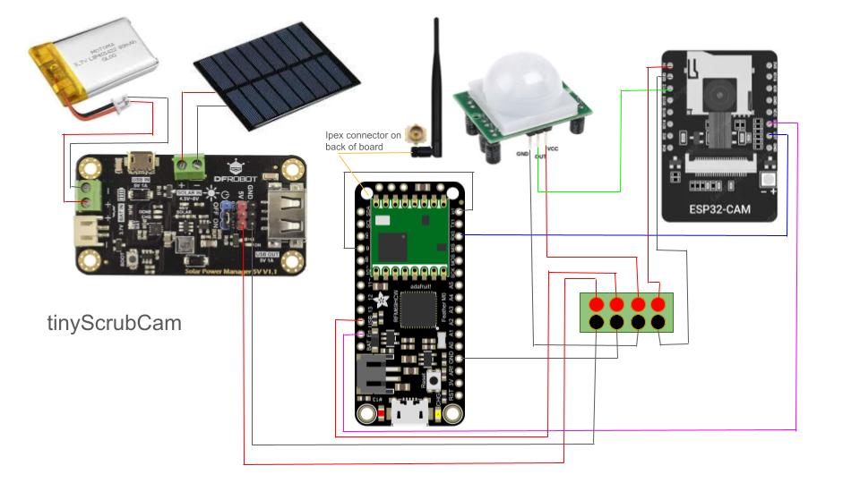

# Rhino Detection

## Set-up
1) Program esp32
   - Ensure microsd card is not inserted
   - Copy/paste the entire rhino model folder into your arduino libraries folder
   - If using FTDI programmer, ensure pins io0 and GND are connected
   - Use board AI - Thinker after installing this board manager > https://adafruit.github.io/arduino-board-index/package_adafruit_index.json and downloading esp32 board library
2) Program feather m0
   - Fill in ABP values and register device with your LoRa server
   - Download MCCI LoRaWAN LMIC library by IBM library
   - Ensure config is set to proper region (868 for Africa, 915 for US)
3) Refer to circuit diagram for wiring.
4) Insert microsd card to esp32cam before turning the solar charge controller to 'on' position
   
## Project Description

This project (folder `rhinoDetection_continuous`) can be downloaded onto the ESP32-CAM and
as is, it will run object detection with a rhino detector
for 10 seconds once triggered by a PIR sensor, which you
will know inference is happening by the red light
on the back of the ESP32-CAM turning on. If a rhino
is detected, it will save detection photos to the SD card, and send
a string over serial to the feather to activate a lora
payload. You can modify the inference time (how long
the device will analyze photos after being triggered, before it
stops and waits again for PIR signal if it doesn't see anything) and
make it so that the photos do not save to the sd card.
